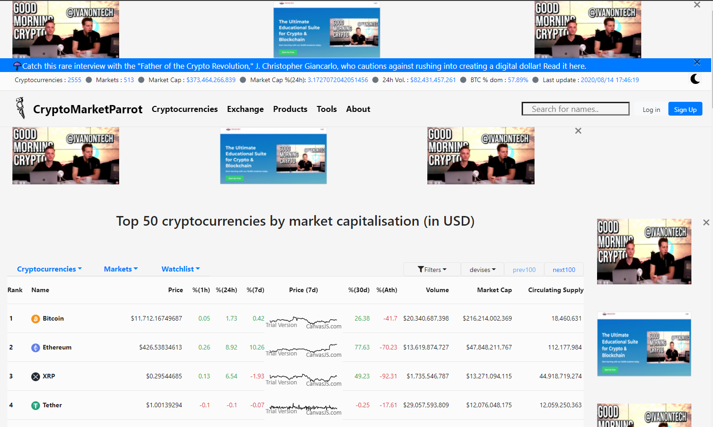
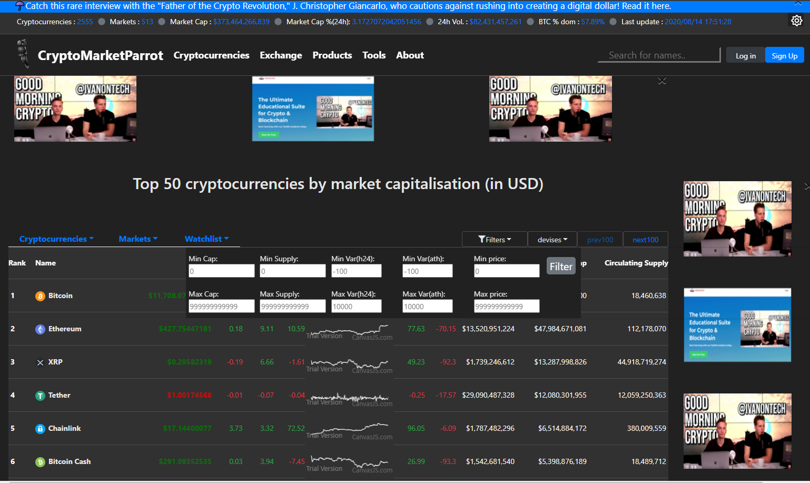
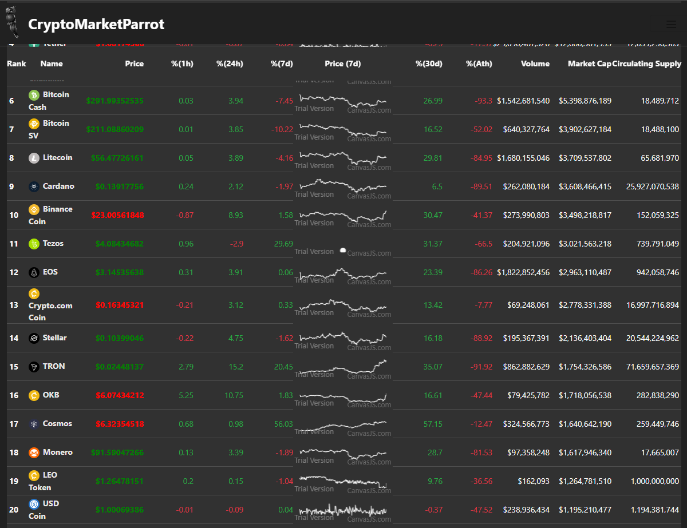
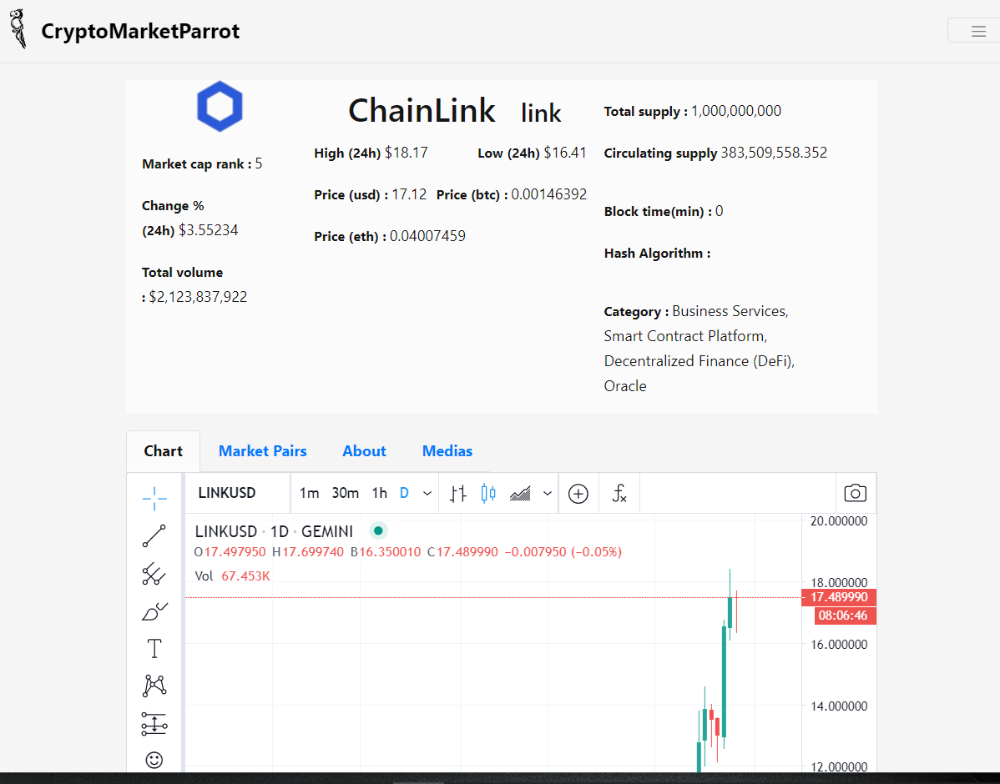
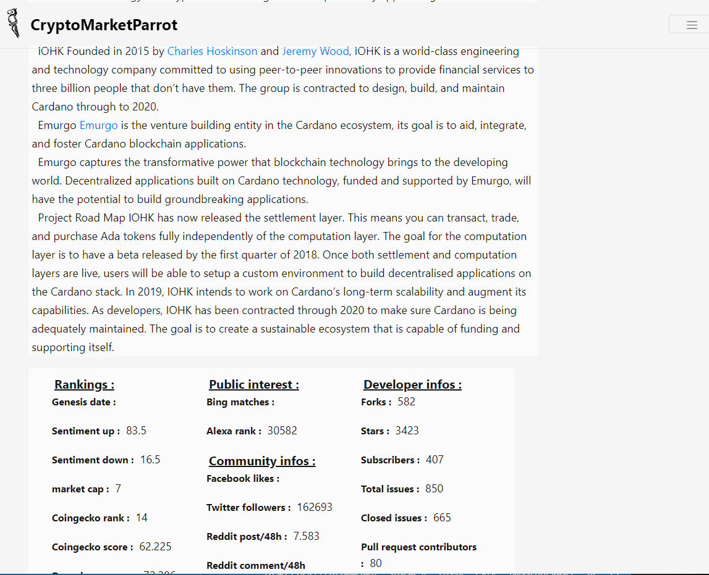

This project was bootstrapped with [Create React App](https://github.com/facebook/create-react-app). In the project directory, you can run:
### `npm start`
Runs the app in the development mode. Open [http://localhost:3000](http://localhost:3000) to view it in the browser.

# Presentation of CryptoMarketParrot :
              
This application is a work in the context of <a href="https://academy.ivanontech.com/">IvanOntech</a>'s bootcamp.
This is the first project to mark the end of the part of the courses on javascript
The statement of duty is to do a clone of <a href="https://coinmarketcap.com/">CoinMarketCap</a> into a week.
   
As I have been following the courses on reactjs from <a href="https://academy.ivanontech.com/">IvanOntech</a> Academy in parallel,
I have tried to carry out this duty in using reactjs.

## Screenshots :

   
## About the development :

### As there is no back-end, there are 2 restrictions:
*The login function is fake.
*There is no intermediary between the customer and the data providers to pre-structure.
the processed data and hide Api keys from third services.

For this reason I only use free api from <a href="https://coinpaprika.com/">coinprapika</a>
and <a href="https://www.coingecko.com/en">coingecko</a>. Therefore the application is subject to a limitation in number of requests.
A backend in this direction would have provided more data (such as on-chain data via glassnode..., blockchair.com, news data via cryptonp.. ).
It would have allow also to manage more request by switching api services.

Thus i did a top 50 instead of a top 100 coins in order to circumvent the request limits because i chose to reproduce the mini chart inranking
with prices updating automatically.

## Features :

### Concerning the theming :
You can switch from light/dark mode via the button on the top right.

Prices are blinking when up or down.

You can close the pubs banner with the clode button or by resizing the screen.

### About the use of the APIs :
All information are updated 2 times a minute (apart static info about a specific coin such as its description, links...).
In the top banner : global infos of the market are displayed with the time of the last update
(every 30 seconds or so).

In the ranking page (main page) 50 of all of the coins are displayed with
a chart of the last 7 days price updated.
If requests are over the limit (mainly when fetching historical price of new displayed coins)
the app will display : 'no data' or 'not yet' the time to wait the next update.

In the coin's page : you have access informations about a specific coin :
its desciption, rankings, market pairs, events, last tweets and a chart from <a href="https://www.tradingview.com/">tradingview</a>.

### Menu and pages :
The app menu currently only leads to:
this page, coin's page, ranking page (the main page), coming soon, and 404.
To access coin's page you can click a coin's name in the ranking or use the search bar in the top menu.

### General :
In the ranking : all columns are sortable, and filtrable. Available currencies are USD and BTC.
Filters and sorting are persistent (so you can change the page) but you cannot combine multiple sorts.

In the coin's page all buttons are functional and i use trading view to display a usable chart
                 (for chart analisys).

Know issues : if you request too many things (sorting, changing the page..) in a little time,
the app can seem to be frozen. Just refresh the page.
  
## To conclude :
As it's my second react app, i learned more about data flow, usage of hooks, context, router, styled components. There's many things
to improve in the structure to better manage the re-render for example but i'm discovering the usage of hooks at the moment.
I need to deepen these aspects to be able to use them better.

I should better choose my charting library. Canvasjs is good but no way to modify the watermark so the result is not top.

The development with react is the part that took the most time. It's the reason why i implemented only these functionalities at the moment.
I'd like to do more (exchanges, on-chain data, filter defi coins, a converter...). There are so many things to add,
but I need to pause this development for to complete my assignement and continue the bootcamp.
